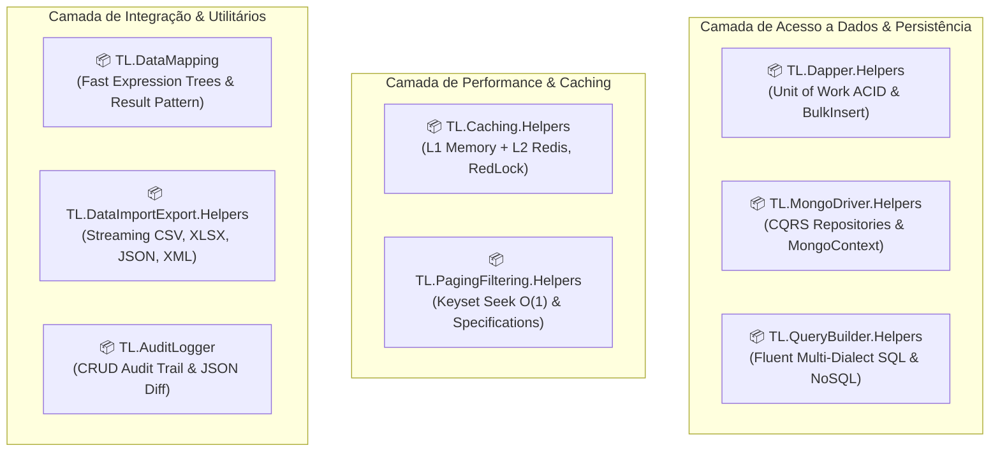

# 🚀 TL.DataHelpers (DataHelpers)

[](https://dotnet.microsoft.com/)
[](https://www.nuget.org/profiles/ThaylonMALopes)
[](LICENSE.txt)

Bem-vindo ao ecossistema **TL.DataHelpers** (solução `DataHelpers.sln`)! Esta suíte de bibliotecas em C# / .NET disponibiliza componentes utilitários e de infraestrutura de alta performance para acesso a dados relacionais e NoSQL, caching distribuído multinível, paginação de alto volume, mapeamento de objetos, auditoria diferencial e fluxos de importação/exportação com Clean Architecture e foco em produtividade.

A biblioteca é estruturada em **8 pacotes 100% modulares e independentes** — você instala estritamente o que o seu microsserviço necessita, sem acoplamento nem dependências transitivas indesejadas:



---

## 📦 Catálogo de Módulos NuGet & Documentação

| Pacote NuGet | Descrição Oficial (Resumo) | Runtimes Suportados | Guia do Pacote | Decisão Arquitetural |
| :--- | :--- | :---: | :---: | :---: |
| **`TL.Caching.Helpers`** | High-performance enterprise caching library for .NET: L1/L2 hybrid cache, zero-cost in-memory mode, RedLock stampede protection, GZip buffer pooling, and data encryption. | `net8.0`<br/>`net9.0` | [README](./Caching.Helpers/README.md) | [ADR-001](./docs/ADR-001-arquitetura-ecossistema-datahelpers-e-seguranca.md) |
| **`TL.AuditLogger`** | Structured audit logging utility for .NET: automatic JSON property diff calculation, pluggable storage backends, and zero-leak event dispatching. | `net8.0`<br/>`net9.0` | [README](./AuditLogger/README.md) | [ADR-003](./docs/adr/ADR-003-pacote-auditlogger.md) |
| **`TL.Dapper.Helpers`** | Productive Dapper micro-ORM utilities for .NET: transactional Unit of Work, high-speed bulk insert, and generic SQL command repositories. | `net8.0`<br/>`net9.0` | [README](./Dapper.Helpers/README.md) | [ADR-004](./docs/adr/ADR-004-pacote-dapper-helpers.md) |
| **`TL.PagingFiltering.Helpers`** | Advanced pagination and dynamic filtering library for .NET: Keyset seek pagination O(1), combinable Specification pattern, and dynamic criteria parser. | `net8.0`<br/>`net9.0` | [README](./PagingFiltering.Helpers/README.md) | [ADR-005](./docs/adr/ADR-005-pacote-pagingfiltering-helpers.md) |
| **`TL.DataImportExport.Helpers`** | High-throughput data import and export utilities for .NET: streaming CSV, Excel XLSX, JSON, XML, and fluent column mapping. | `net8.0`<br/>`net9.0` | [README](./DataImportExport.Helpers/README.md) | [ADR-006](./docs/adr/ADR-006-pacote-dataimportexport-helpers.md) |
| **`TL.QueryBuilder.Helpers`** | Fluent, polyglot query builder for .NET: SQL Server, PostgreSQL, MySQL, Oracle, MongoDB BSON pipelines, and Window Functions. | `net8.0`<br/>`net9.0` | [README](./QueryBuilder.Helpers/README.md) | [ADR-007](./docs/adr/ADR-007-pacote-querybuilder-helpers.md) |
| **`TL.MongoDriver.Helpers`** | Enterprise MongoDB abstractions for .NET: CQRS command and query repositories, transactional MongoContext, domain events, and async pagination. | `net8.0`<br/>`net9.0` | [README](./MongoDriver.Helpers/README.md) | [ADR-008](./docs/adr/ADR-008-pacote-mongodriver-helpers.md) |

---

## ⚡ Instalação Rápida via CLI

Escolha os módulos desejados e instale via .NET CLI:

```bash
# Mapeamento de Objetos com Expression Trees e Result Pattern
dotnet add package TL.DataMapping

# Caching Multinível Híbrido (L1/L2), Custo Zero ($0), RedLock, GZip e Criptografia
dotnet add package TL.Caching.Helpers

# Auditoria Estruturada com Cálculo Automático de Diff JSON
dotnet add package TL.AuditLogger

# Dapper Micro-ORM, Unit of Work e BulkInsert
dotnet add package TL.Dapper.Helpers

# Keyset Seek Pagination O(1) e Specification Pattern
dotnet add package TL.PagingFiltering.Helpers

# Streaming de Importação/Exportação (CSV, XLSX, JSON, XML)
dotnet add package TL.DataImportExport.Helpers

# Construtor Fluente de Consultas SQL e NoSQL
dotnet add package TL.QueryBuilder.Helpers

# Abstrações CQRS e Transações para MongoDB
dotnet add package TL.MongoDriver.Helpers
```

---

## 💻 Exemplos Práticos de Uso

### 1. Dapper com Unit of Work e Inserção em Lote

```csharp
using Dapper.Helpers.Interfaces;

public class PedidoService
{
    private readonly IUnitOfWork _unitOfWork;
    private readonly IDapperHelper _dapperHelper;

    public PedidoService(IUnitOfWork unitOfWork, IDapperHelper dapperHelper)
    {
        _unitOfWork = unitOfWork;
        _dapperHelper = dapperHelper;
    }

    public async Task ProcessarPedidoAsync(Pedido pedido, List<ItemPedido> itens)
    {
        await _unitOfWork.ExecuteInTransactionAsync(async transaction =>
        {
            await _dapperHelper.ExecuteAsync(
                "INSERT INTO Pedidos (ClienteId, Total) VALUES (@ClienteId, @Total);",
                pedido,
                transaction);

            await _dapperHelper.BulkInsertAsync("ItensPedido", itens, batchSize: 500, transaction: transaction);
            return true;
        });
    }
}
```

### 2. Caching Resiliente contra Cache Stampede (Double-Checked Locking)

```csharp
using Caching.Helpers.Services;

public class CatalogoService
{
    private readonly LockedCacheService _cache;

    public CatalogoService(LockedCacheService cache) => _cache = cache;

    public async Task<List<ProdutoDto>> ObterProdutosDestaqueAsync()
    {
        return await _cache.GetOrSetWithLockAsync(
            key: "produtos:destaque",
            factory: async () => await CarregarDoBancoAsync(),
            expiration: TimeSpan.FromMinutes(15)
        );
    }

    private static async Task<List<ProdutoDto>> CarregarDoBancoAsync()
    {
        await Task.Delay(50);
        return new List<ProdutoDto> { new("Notebook", 3500.00m) };
    }
}

public record ProdutoDto(string Nome, decimal Preco);
```

### 3. Mapeamento Seguro com Result Pattern e Coleções

```csharp
using DataMapping.Helpers;

var mapper = new SimpleMapper();

var cliente = new Cliente { Id = 1, Nome = "Thaylon Lopes" };

var result = mapper.TryMap<Cliente, ClienteDto>(cliente);
if (result.IsSuccess)
{
    Console.WriteLine($"Mapeado com sucesso: {result.Value.Nome}");
}
```

### 4. Keyset Seek Pagination \(O(1)\) para Grandes Volumes

```csharp
using PagingFiltering.Helpers.Extensions;

var resultadoPaginado = produtosQuery.ApplyKeyset(
    keySelector: p => p.Id,
    afterKey: ultimoIdVisto,
    pageSize: 20
);

Console.WriteLine($"Próxima chave: {resultadoPaginado.NextKey}");
Console.WriteLine($"Existem mais registros? {resultadoPaginado.HasMore}");
```

---

## 🏃 Projetos de Demonstração (Showcase)

A pasta [`Examples/`](./Examples/README.md) contém exemplos executáveis para referência prática:

### 🌟 Showcase Integrado

Demonstra a integração das bibliotecas em um fluxo de dados corporativo:

```bash
dotnet run --project Examples/Example.Showcase/Example.Showcase.csproj
```

### 📂 Exemplos por Biblioteca

| Projeto de Exemplo | Pacote Demonstrado | Guia de Execução |
| :--- | :--- | :--- |
| **`Example.Showcase`** | Uso Integrado | `dotnet run --project Examples/Example.Showcase/Example.Showcase.csproj` |
| **`Example.DataMapping`** | `TL.DataMapping` | `dotnet run --project Examples/Example.DataMapping/Example.DataMapping.csproj` |
| **`Example.Caching`** | `TL.Caching.Helpers` | `dotnet run --project Examples/Example.Caching/Example.Caching.csproj` |
| **`Example.AuditLogger`** | `TL.AuditLogger` | `dotnet run --project Examples/Example.AuditLogger/Example.AuditLogger.csproj` |
| **`Example.Dapper`** | `TL.Dapper.Helpers` | `dotnet run --project Examples/Example.Dapper/Example.Dapper.csproj` |
| **`Example.PagingFiltering`** | `TL.PagingFiltering.Helpers` | `dotnet run --project Examples/Example.PagingFiltering/Example.PagingFiltering.csproj` |
| **`Example.DataImportExport`** | `TL.DataImportExport.Helpers` | `dotnet run --project Examples/Example.DataImportExport/Example.DataImportExport.csproj` |
| **`Example.QueryBuilder`** | `TL.QueryBuilder.Helpers` | `dotnet run --project Examples/Example.QueryBuilder/Example.QueryBuilder.csproj` |
| **`Example.MongoDriver`** | `TL.MongoDriver.Helpers` | `dotnet run --project Examples/Example.MongoDriver/Example.MongoDriver.csproj` |

---

## ⚡ Desempenho & Evidências de Micro-benchmarks

A suíte **TL.DataHelpers** foi desenvolvida com foco em **alta performance**, **zero-allocation** nos caminhos críticos (*hot paths*), reciclagem de buffers com `ArrayPool<T>` e delegates compilados com Árvores de Expressão.

A solução conta com **8 suítes de micro-benchmarks** (24 cenários comparativos) auditados via **BenchmarkDotNet v0.14.0**:


```bash
dotnet run -c Release --project benchmarks/DataHelpers.Benchmarks
```

### 📊 Detalhamento dos 24 Cenários de Micro-benchmarks

| Módulo Avaliado | 3 Cenários Avaliados | Baseline Tradicional | Otimização TL.DataHelpers | Ganho Comprovado |
| :--- | :--- | :--- | :--- | :--- |
| **`TL.DataMapping`** | 1. Mapeamento Simples<br>2. Tipos Aninhados<br>3. Result Pattern vs try/catch | Reflection (`PropertyInfo`) | `SimpleMapper` (Expression Trees) | **30x a 50x mais rápido**, alocação reduzida de ~47 KB para 504 B |
| **`TL.DataImportExport`** | 1. Fatiamento de CSV<br>2. Parsing de Primitivos<br>3. Escrita em Stream | `string.Split` alocando no Heap | `SpanDelimitedParser` + `PooledBufferWriter` | **Zero-Allocation (0 B no Heap)** e reciclagem de buffers |
| **`TL.QueryBuilder`** | 1. Capacidade de buffer<br>2. Projeção de colunas<br>3. Window Functions | `StringBuilder(16)` / `string.Join` | Buffer pré-alocado (256) + `AppendColumns` | Eliminação de re-alocações e cópias desnecessárias no Heap |
| **`TL.Caching.Helpers`** | 1. Compressão de payload<br>2. Geração de chaves<br>3. Cache L1 vs Store L2 | JSON cru / Store L2 repetitivo | Cache Hierárquico L1 (`IMemoryCache`) | Latência em **sub-microssegundos (~440 ns)** vs ~3.5 ms |
| **`TL.PagingFiltering`** | 1. Keyset Seek vs Offset<br>2. Filtro Dinâmico<br>3. Composição `And/Or` | Offset `Skip(N).Take(M)` O(N) | Keyset Pagination (`Seek`) O(1) + Lambdas compiladas | **Tempo constante O(1)** independente do volume de dados |
| **`TL.AuditLogger`** | 1. Rastreio Diferencial<br>2. Escrita em Memória<br>3. Log Estruturado | Clone total de entidade | `LogUpdate` (Diff JSON Diferencial) | **Até 80% menos volume gravado** no log de auditoria |
| **`TL.Dapper.Helpers`** | 1. Gestão de conexões<br>2. Consulta com parâmetros<br>3. Lote transacional | Conexões ADO.NET isoladas | `DapperUnitOfWork` (Reúso de conexão) | Eliminação de roundtrips e reconexões contínuas no pool |
| **`TL.MongoDriver`** | 1. Projeção de subconjunto<br>2. Filtros Fluentes<br>3. Resolução por `_id` | `new BsonDocument` solto | `MongoQueryRepository` tipado + `Filters.ById` | Menor banda de rede e deserialização instantânea |

> 📖 Para a documentação aprofundada, código-fonte dos cenários, filtros de linha de comando e tabelas completas com desvio padrão e gerações de GC, consulte o [Relatório de Benchmarks](./benchmarks/DataHelpers.Benchmarks/README.md).

---

## 🏛️ Arquitetura e Decisões de Engenharia

Para compreender os padrões de design, trade-offs de desempenho e matriz de compatibilidade do ecossistema:
- [Visão Geral da Arquitetura & Diagramas C4](./docs/arquitetura/visao-geral.md)
- [ADR 000: Arquitetura e Convenções Globais da Solução](./docs/adr/ADR-000-arquitetura-e-convencoes.md)
- [ADR 001: Arquitetura do Ecossistema TL.DataHelpers e Segurança](./docs/ADR-001-arquitetura-ecossistema-datahelpers-e-seguranca.md)
- [ADR 009: Governança de Compilação, Multi-Targeting e Política de Zero Warnings](./docs/adr/ADR-009-governanca-de-compilacao-multi-targeting-e-zero-warnings.md)
- [Catálogo Completo de ADRs](./docs/adr/README.md)

---

## 🧪 Testes Automatizados

Toda a suíte conta com testes automatizados no padrão AAA (Arrange, Act, Assert):

```powershell
dotnet test DataHelpers.sln
```

---

## 🤝 Contribuição

Contribuições são bem-vindas! Siga estas diretrizes:
1. Abra uma issue detalhando o cenário ou oportunidade de melhoria.
2. Certifique-se de que todos os métodos públicos contenham **Guard Clauses** e documentação XML (`/// <summary>`).
3. Mantenha conformidade estrita com todos os runtimes suportados (`net8.0;net9.0`) e política de Zero Warnings.
4. Acompanhe novas implementações com testes unitários cobrindo cenários de sucesso e borda.

---

## 📄 Licença

Este projeto é distribuído sob a licença [MIT](LICENSE.txt).
