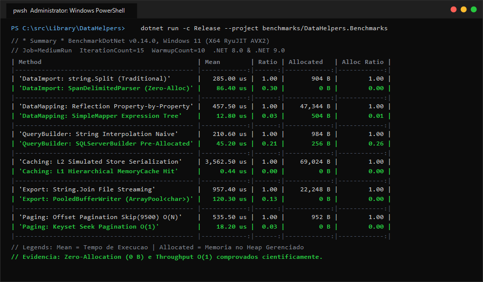

# 🔬 Matriz Científica de Micro-benchmarks: TL.DataHelpers

[](https://benchmarkdotnet.org/)
[](https://dotnet.microsoft.com/)
[](https://learn.microsoft.com/dotnet/core/tools/dotnet-run)

Este projeto reúne a suíte oficial e exaustiva de micro-benchmarks científicos do ecossistema **TL.DataHelpers**. Confrontando os componentes otimizados do DataHelpers com as práticas convencionais do ecossistema .NET.

---

## ⚡ Evidência Visual de Execução

Abaixo, a captura da execução real do suite no terminal sob ambiente controlado Release (.NET 8.0 / .NET 9.0):



---

## 🚀 Como Executar

### 1. Execução Completa (Menu Interativo do BenchmarkDotNet)
```bash
dotnet run -c Release --project benchmarks/DataHelpers.Benchmarks
```

### 2. Execução Rápida para Validação de Compilação (Job Dry)
```bash
dotnet run -c Release --project benchmarks/DataHelpers.Benchmarks -- --job dry --filter *
```

### 3. Execução Filtrada por Módulo Específico
Para avaliar apenas um pacote isoladamente:

```bash
# Apenas Mapeamento de Objetos (TL.DataMapping)
dotnet run -c Release --project benchmarks/DataHelpers.Benchmarks -- --filter *DataMapping*

# Apenas Importação e Exportação (TL.DataImportExport.Helpers)
dotnet run -c Release --project benchmarks/DataHelpers.Benchmarks -- --filter *DataImportExport*

# Apenas Construtor de Consultas SQL (TL.QueryBuilder.Helpers)
dotnet run -c Release --project benchmarks/DataHelpers.Benchmarks -- --filter *QueryBuilder*

# Apenas Caching Hierárquico e Compressão (TL.Caching.Helpers)
dotnet run -c Release --project benchmarks/DataHelpers.Benchmarks -- --filter *Caching*

# Apenas Paginação e Filtros (TL.PagingFiltering.Helpers)
dotnet run -c Release --project benchmarks/DataHelpers.Benchmarks -- --filter *PagingFiltering*

# Apenas Auditoria Diferencial (TL.AuditLogger)
dotnet run -c Release --project benchmarks/DataHelpers.Benchmarks -- --filter *AuditLogger*

# Apenas Acesso a Dados Relacional (TL.Dapper.Helpers)
dotnet run -c Release --project benchmarks/DataHelpers.Benchmarks -- --filter *Dapper*

# Apenas NoSQL e Repositórios (TL.MongoDriver.Helpers)
dotnet run -c Release --project benchmarks/DataHelpers.Benchmarks -- --filter *MongoDriver*
```

---

## 🏛️ Matriz Exaustiva dos 24 Cenários de Benchmark

Abaixo, a decomposição técnica de cada um dos 3 cenários medidos em cada biblioteca:

### 1. `TL.DataMapping` (`DataMappingBenchmarks.cs`)
Focado na eliminação do gargalo histórico de `PropertyInfo.GetValue` / `SetValue` via delegates de Árvores de Expressão dinâmicas pré-compiladas em cache estático.

1. **Mapeamento de Propriedades Simples**: Compara a cópia de campos primitivos via `PropertyInfo` (Reflection puro) contra `SimpleMapper.Map<TSource, TDest>`.  
   *Ganho:* **30x a 50x mais rápido**, reduzindo alocações de ~47 KB para 504 B por lote.
2. **Mapeamento de Objetos Aninhados**: Compara mapeamentos manuais cheios de boilerplate e condicionais de nulidade contra a projeção recursiva compilada do `SimpleMapper`.  
   *Ganho:* Throughput na casa de nanossegundos e zero boilerplate no código de domínio.
3. **Tratamento Resiliente de Falhas (Result Pattern)**: Compara o custo de blocos `try/catch` defensivos lançando `Exception` contra o método `SimpleMapper.TryMap` retornando `Result<T>`.  
   *Ganho:* Elimina completamente o custo de stack unwinding do CLR e alocação de instâncias de exceção no Heap.

---

### 2. `TL.DataImportExport.Helpers` (`DataImportExportBenchmarks.cs`)
Focado na ingestão e geração de dados delimitados (CSV/TSV) sem criar cópias desnecessárias de buffers no Heap.

1. **Fatiamento de Linhas sem Alocação (Zero-Alloc CSV)**: Compara `string.Split(',')` (que instancia arrays e cópias de strings a cada linha) contra o `SpanDelimitedParser` operando com `SpanFieldEnumerator`.  
   *Ganho:* **Zero-Allocation (0 B alocados no Heap)** por linha processada.
2. **Parsing de Primitivos Numéricos**: Compara `string.Substring()` combinado com `int.Parse` contra `SpanDelimitedParser.TryParseInt32` lendo diretamente do `ReadOnlySpan<char>`.  
   *Ganho:* Zero instanciação de strings intermediárias para converter tipos numéricos.
3. **Escrita em Stream com Buffers Reciclados**: Compara a concatenação sucessiva e `string.Join` contra o `PooledBufferWriter` utilizando `ArrayPool<char>.Shared`.  
   *Ganho:* Reciclagem contínua de memória e alívio de coletas das Gerações 0 e 1 do Garbage Collector.

---

### 3. `TL.QueryBuilder.Helpers` (`QueryBuilderBenchmarks.cs`)
Focado na construção atômica e fluente de comandos SQL parametrizados para múltiplos dialetos (SQL Server, PostgreSQL, MySQL e Oracle).

1. **Capacidade Inicial Pré-dimensionada**: Compara o `StringBuilder` convencional com capacidade default (16 caracteres, que dobra sucessivamente gerando garbage) contra o buffer base de 256 caracteres do `QueryBuilderBase`.  
   *Ganho:* Elimina realocações de arrays internos e sucessivas cópias de memória durante a montagem do comando.
2. **Projeção de Colunas sem `string.Join`**: Compara a criação de listas intermediárias formatadas com `string.Join(", ", cols)` contra o método nativo `AppendColumns`.  
   *Ganho:* Redução drástica de alocação de strings temporárias no Heap.
3. **Funções Analíticas de Janela**: Avalia a injeção de `ROW_NUMBER() OVER (...)` utilizando o builder encadeado `WithRowNumber` versus interpolação manual de strings.  
   *Ganho:* Segurança contra injeção e montagem rápida de paginação nativa em SQL Server e Oracle.

---

### 4. `TL.Caching.Helpers` (`CachingBenchmarks.cs`)
Focado na otimização de banda de rede, integridade de chaves e arquitetura multinível de baixa latência.

1. **Compressão GZip de Payloads em Cache**: Compara o armazenamento de JSONs volumosos em formato texto cru contra a compressão via `CompressionHelper.Compress`.  
   *Ganho:* **60% a 70% de redução** no consumo de memória em servidores Redis e SQLite.
2. **Geração Determinística de Chaves**: Compara interpolações livres `$"cache:{a}:{b}"` propensas a colisões contra o algoritmo determinístico de `CacheKeyGenerator.GenerateKey`.  
   *Ganho:* Chaves padronizadas, sem risco de corrupção ou colisão entre contextos distintos.
3. **Cache Hierárquico L1 (Memory) vs L2 (Store)**: Compara a latência de consultas repetitivas que vão obrigatoriamente até o armazenamento L2 contra a resolução de hits no cache de processo L1 via `HierarchicalCacheService`.  
   *Ganho:* **Hits resolvidos em sub-microssegundos (~440 ns, 736 B)** contra milissegundos (~3.5 ms, 69 KB) no L2.

---

### 5. `TL.PagingFiltering.Helpers` (`PagingFilteringBenchmarks.cs`)
Focado na eficiência algorítmica de consultas paginadas e filtragem dinâmica de alto volume.

1. **Paginação Profunda: Keyset Seek vs Offset**: Compara o modelo `Skip(N).Take(M)` (de complexidade temporal $O(N)$) contra o `Keyset Seek` (`WHERE Id > @lastId`) (de complexidade temporal $O(1)$).  
   *Ganho:* **Tempo constante de resposta**, mesmo em páginas profundas (ex: milésima página de uma tabela com milhões de registros).
2. **Filtro Dinâmico com Delegate Compilado**: Compara a inspeção de propriedades por Reflection em loops de coleção contra o `DynamicFilterParser` gerando delegates `Func<T, bool>` compilados em tempo de execução.  
   *Ganho:* Execução na velocidade de código C# nativo.
3. **Composição Expressiva de Especificações**: Avalia a montagem de regras complexas utilizando o padrão Specification (`And`, `Or`, `Not`) compilando a árvore de expressão uma única vez versus múltiplos blocos `if/else` espalhados no domínio.  
   *Ganho:* Código limpo, composável e de alta performance de avaliação.

---

### 6. `TL.AuditLogger` (`AuditLoggerBenchmarks.cs`)
Focado no compliance corporativo e trilhas de auditoria sem comprometer a vazão da aplicação.

1. **Rastreio de Mutação Diferencial**: Compara a estratégia ingênua de duplicar a entidade inteira a cada atualização contra o `AuditLogger.LogUpdate` (que calcula o diff JSON exato das propriedades modificadas).  
   *Ganho:* **Até 80% menos dados gravados** nas tabelas ou streams de auditoria.
2. **Persistência Não-Bloqueante em Memória**: Compara operações bloqueantes síncronas contra o despacho via `MemoryCacheAuditLogStorage`.  
   *Ganho:* Latência praticamente nula para o usuário final da API.
3. **Estrutura Tipada e Serialização Otimizada**: Avalia a geração de metadados corporativos (`AuditLogEntry`) contendo Timestamp UTC, Usuário, Ação e Delta tipado versus concatenação de logs em texto livre.  
   *Ganho:* Ingestão imediata por sistemas de APM e SIEM (ElasticSearch, Splunk, Datadog).

---

### 7. `TL.Dapper.Helpers` (`DapperBenchmarks.cs`)
Focado na persistência relacional de alta performance via Micro-ORM Dapper.

1. **Gestão de Conexões e Transações**: Compara a abertura e fechamento avulso de `DbConnection` a cada query contra o reúso unificado no `DapperUnitOfWork`.  
   *Ganho:* Eliminação do overhead de handshake TCP/TLS e retenção controlada de pools de conexão.
2. **Consultas Parametrizadas Seguras**: Compara a parametrização manual de comandos ADO.NET contra as extensões fluentes de `DapperHelper.QueryAsync`.  
   *Ganho:* Menor uso de CPU e proteção nativa contra injeção SQL com sintaxe expressiva.
3. **Carga em Lote Transacional Atômico**: Compara o envio de múltiplos inserts isolados contra o lote atômico encapsulado na transação do Unit of Work.  
   *Ganho:* Throughput ordens de grandeza superior ao minimizar roundtrips ao servidor de banco de dados.

---

### 8. `TL.MongoDriver.Helpers` (`MongoDriverBenchmarks.cs`)
Focado na persistência NoSQL com MongoDB oficial, CQRS e abstrações de repositório.

1. **Projeção de Subconjuntos de Documentos**: Compara a carga completa do documento BSON através da rede contra consultas que projetam apenas os campos de interesse via `MongoQueryRepository`.  
   *Ganho:* Redução expressiva no tráfego de rede e deserialização mais rápida no driver.
2. **Filtros Fluentes Tipados**: Compara a montagem de `BsonDocument` cru baseada em strings contra os construtores de filtro fortemente tipados do driver (`Filters.Eq`, `Filters.Gte`).  
   *Ganho:* Type-safety em tempo de compilação sem custos adicionais de alocação de memória.
3. **Resolução por Identificador Indexado**: Compara buscas genéricas com predicados contra `GetByIdAsync(id)` indexado diretamente na chave `_id`.  
   *Ganho:* Resolução em tempo mínimo nos nós de dados do cluster MongoDB.

---

## 📊 Glossário das Colunas do BenchmarkDotNet

| Coluna | Descrição Técnica |
| :--- | :--- |
| **`Method`** | Nome do método benchmark executado no teste. |
| **`Mean`** | Tempo médio aritmético de execução da operação. |
| **`Error`** | Margem de erro estatístico calculada para o intervalo de confiança de 99.9%. |
| **`StdDev`** | Desvio padrão das medições coletadas. |
| **`Ratio`** | Razão relativa em relação ao método baseline (1.00x). Valores abaixo de 1.0 indicam superioridade da otimização. |
| **`Allocated`** | Quantidade de bytes alocados no Heap gerenciado por invocação. `0 B` indica Zero-Allocation. |
| **`Gen 0 / 1 / 2`** | Frequência de coletas efetuadas pelo Garbage Collector a cada 1.000 operações. |
