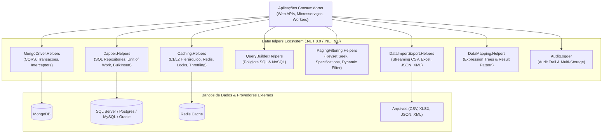
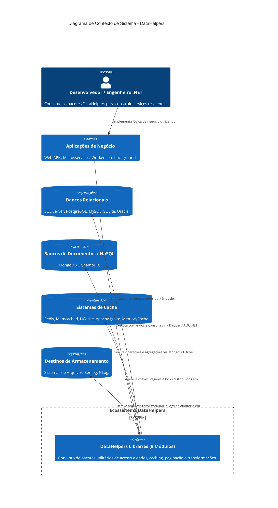
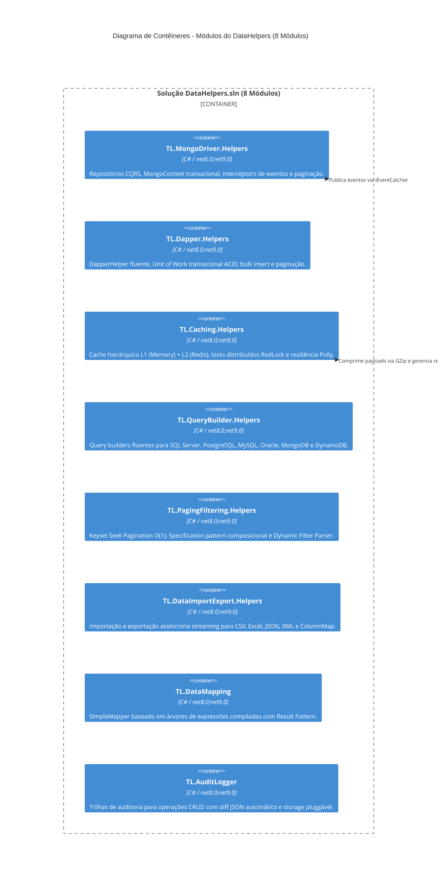

# 🏛️ Visão Geral da Arquitetura: TL.DataHelpers (DataHelpers)

## 📌 1. Visão Geral e Propósito do Sistema

O **TL.DataHelpers** (solução `DataHelpers.sln`) é uma suíte modular de bibliotecas utilitárias e componentes de infraestrutura construídos em **.NET 8.0 / .NET 9.0 (C# 12)**, projetada para acelerar o desenvolvimento de aplicações corporativas, microsserviços e Web APIs de alta performance.

O propósito central do ecossistema é eliminar a duplicação de código em operações comuns de acesso a dados (SQL e NoSQL), construção dinâmica de consultas, estratégias avançadas de caching multinível, paginação, filtragem, mapeamento de objetos, auditoria de dados e fluxos de importação/exportação de arquivos.

---

## 🏛️ 2. Modelo C4 - Diagramas de Arquitetura

### Nível 1: Diagrama de Contexto de Sistema (C4 Context)

---

### Nível 2: Diagrama de Contêineres (C4 Containers)

---

## 📦 3. Catálogo Detalhado de Módulos

### 3.1. `MongoDriver.Helpers` (`TL.MongoDriver.Helpers`)
- **Papel:** Abstração completa sobre o driver oficial do MongoDB (`MongoDB.Driver 3.0.0`).
- **Principais Componentes:**
  - `MongoContext` (`IMongoContext`): Gerencia sessões transacionais (`IClientSessionHandle`), enfileiramento de comandos e persistência atômica via `SaveChanges()`.
  - `MongoCommandRepository<T>` / `MongoQueryRepository<T>`: Segregação explícita entre operações de escrita e leitura (CQRS).
  - `MultiCollectionSearchHelper<T>`: Execução de consultas, buscas em texto e agregações cruzadas entre múltiplas coleções.
  - `CaptureEventsInterceptor` / `SaveChangesInterceptor`: Interceptores para disparo de eventos de domínio antes/após commits.
  - `EventCatcher`, `EventHandler`, `Raiser`: Infraestrutura para vinculação dinâmica de handlers e eventos baseados em `IEvent`.
- **Injeção de Dependência:** `services.AddMongoDbContext<TContext>(configuration)`.

### 3.2. `Dapper.Helpers` (`TL.Dapper.Helpers`)
- **Papel:** Facilita a execução de operações SQL, mapeamento objeto-relacional e paginação via Dapper (`Dapper 2.1.35`).
- **Principais Componentes:**
  - `DapperHelper` (`IDapperHelper`): Encapsula execuções escalares, comandos assíncronos e queries tipadas.
  - `IUnitOfWork`: Gerenciamento transacional ACID multi-repositório com rollback automático em caso de falha.
  - `DapperCommandRepository<T>`: Repositório genérico com geração automática de comandos `INSERT`, `UPDATE`, `DELETE` e queries paginadas.
  - `BulkInsertAsync`: Inserção em lotes de alta performance via `SqlBulkCopy` / `Microsoft.Data.SqlClient`.
  - `GenerateWhereClause`: Tradução de árvores de expressão LINQ (`Expression<Func<T, bool>>`) para cláusulas SQL `WHERE`.

### 3.3. `Caching.Helpers` (`TL.Caching.Helpers`)
- **Papel:** Sistema de cache de alta performance com suporte a múltiplos provedores e estratégia multinível.
- **Principais Componentes:**
  - `HierarchicalCacheService` (`IHierarchicalCacheService`): Cache em 2 camadas: L1 local em memória (`IMemoryCache`) com fallback para L2 distribuído (`ICacheService`), incluindo métricas de hit/miss.
  - `RedisCacheService`: Implementação para Redis com compressão GZip automática (`CompressionHelper`) e invalidação por regiões/tenants.
  - `LockedCacheService`: Decorator que implementa Distributed Locking via `RedLock.net` para prevenir condições de corrida (*cache stampede* via Double-Checked Locking).
  - `ThrottledCacheService`: Decorator com controle de vazão e resiliência via `Polly`.
  - Adapters: `MemcachedCacheService`, `NCacheService`, `IgniteCacheService`, `SQLiteCacheService`.

### 3.4. `QueryBuilder.Helpers` (`TL.QueryBuilder.Helpers`)
- **Papel:** Construtor fluente de consultas SQL e NoSQL polimórfico e extensível.
- **Implementações Específicas:**
  - `SQLServerQueryBuilder`, `PostgreSQLQueryBuilder`, `MySQLQueryBuilder`, `OracleQueryBuilder`.
  - `MongoDBQueryBuilder`: Geração de queries e pipelines de agregação BSON.
  - `DynamoDBQueryBuilder`: Expressões de consulta para AWS DynamoDB.
- **Capacidades:** `Select`, `From`, `Where`, `And`, `Or`, `OrderBy`, `Limit`, `Offset`, `Join` (Inner, Left, Right, Full), `GroupBy`, `Having`, `Distinct`, `SubQuery`, `Union`, `UnionAll`, Window Functions (`WithRowNumber`, `WithRank`).

### 3.5. `PagingFiltering.Helpers` (`TL.PagingFiltering.Helpers`)
- **Papel:** Paginação flexível e filtragem avançada baseada em especificações.
- **Principais Componentes:**
  - **Keyset Seek Pagination:** `ApplyKeyset(...)` e `PagedResultKeyset<T, TKey>` com tempo constante O(1) para feeds e grandes volumes.
  - **Specification Pattern:** `ISpecification<T>`, `Specification<T>`, `AndSpecification<T>`, `OrSpecification<T>`, `NotSpecification<T>` com `ParameterReplacer`.
  - `DynamicFilterParser`: Parser de critérios dinâmicos (`FilterCriterion`) para árvores de expressão tipadas.
  - `PaginationHelper<T>` / `PaginationFilterHelper<T>`: Paginação baseada em offset (`PagedResult<T>`) e por cursor (`PagedResultCursor<T>`).

### 3.6. `DataImportExport.Helpers` (`TL.DataImportExport.Helpers`)
- **Papel:** Mecanismo unificado de importação e exportação de dados tabulares e estruturados.
- **Formatos Suportados:**
  - **CSV:** `CsvDataImporter` e `CsvDataExporter` utilizando `CsvHelper 33.0.1`.
  - **Excel:** `ExcelDataImporter` e `ExcelDataExporter` utilizando `ClosedXML 0.104.1`.
  - **JSON:** `JsonDataImporter` e `JsonDataExporter` com `System.Text.Json`.
  - **XML:** `XmlDataImporter` e `XmlDataExporter` nativo via streaming com suporte a namespaces.
  - `ColumnMap<T>`: Mapeador fluente para correspondência de colunas heterogêneas.

### 3.7. `DataMapping.Helpers` (`TL.DataMapping`)
- **Papel:** Mapeador de objetos ultrarrápido em memória com Result Pattern.
- **Funcionamento:** Compila dinamicamente árvores de expressões (`Expression.MemberInit`, `Expression.Lambda`) para realizar binding direto de propriedades públicas sem custo contínuo de reflexão, com cache thread-safe em `ConcurrentDictionary`.
- **Diferenciais:** `TryMap<TSource, TDestination>` retornando `Result<TDestination>`, suporte a coleções aninhadas e conversores customizados (`ITypeConverter<TSource, TDestination>`).

### 3.8. `AuditLogger` (`TL.AuditLogger`)
- **Papel:** Rastreamento e persistência de auditoria de operações (`CREATE`, `READ`, `UPDATE`, `DELETE`).
- **Principais Componentes:**
  - `AuditLogger` (`IAuditLogger`): Registra entradas de auditoria (`AuditLogEntry`) capturando usuário, entidade, timestamps e cálculo automático de diferencial JSON por propriedade (`Old`, `New`, `Diff`).
  - `AuditLogStorageFactory`: Criação sob demanda do armazenamento configurado (`SerilogAuditLogStorage`, `NLogAuditLogStorage`, `MemoryCacheAuditLogStorage`).

---

## ⚙️ 4. Diretrizes de Engenharia e Boas Práticas

1. **Parâmetros de Entrada e Fail-Fast:** Todo método público valida argumentos de entrada via Guard Clauses (`ArgumentNullException.ThrowIfNull(argumento)`).
2. **Eliminação de Falhas Silenciosas:** Proibição estrita de engolir exceções ou retornar estados inconsistentes. Uso extensivo do Result Pattern (`Result<T>`) para tratamento explícito de erros.
3. **Multi-Targeting Rígido:** Compatibilidade garantida simultaneamente para `.NET 8.0` (LTS) e `.NET 9.0` (STS), com política de Zero Warnings (`<TreatWarningsAsErrors>true</TreatWarningsAsErrors>`).
4. **Isolamento Total entre Pacotes:** Zero dependências de projeto cruzadas (`ProjectReference`) entre os 8 módulos de produção, garantindo autonomia máxima para aplicações consumidoras.
5. **Async/Await Ubíquo:** Todas as operações de I/O (disco, banco de dados, cache e rede) utilizam interfaces assíncronas com suporte a `CancellationToken`.

---

## 🔗 5. Integração e Relação com Outros Ecossistemas

- **Ecossistema TL.ResilientCore:** Consome os componentes do DataHelpers (como `MongoDriver.Helpers`, `Caching.Helpers` e `QueryBuilder.Helpers`) como blocos de persistência e caching nos microsserviços corporativos.
- **Ecossistema CommonHelpers:** Complementa os utilitários de Health Checks e envelopes `RequestResponse` com capacidades especializadas de persistência e manipulação de dados.
- **Ecossistema TL.MiddlewareLibrary:** Atua em conjunto com o `Caching.Helpers` para estratégias de caching HTTP e rate limiting no pipeline ASP.NET Core.
- **Ecossistema TL.UtilExtensions (ExtensionLibrary):** Fornece métodos de extensão utilitários de alta performance sobre tipos primitivos, coleções e reflexão para enriquecer as manipulações internas.

